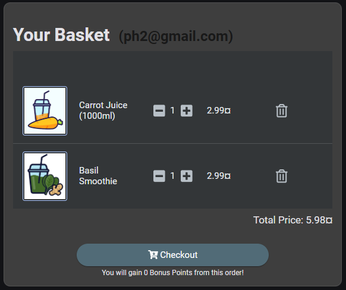
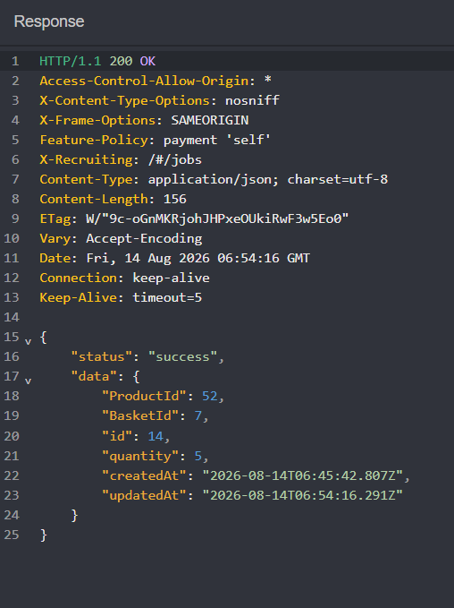
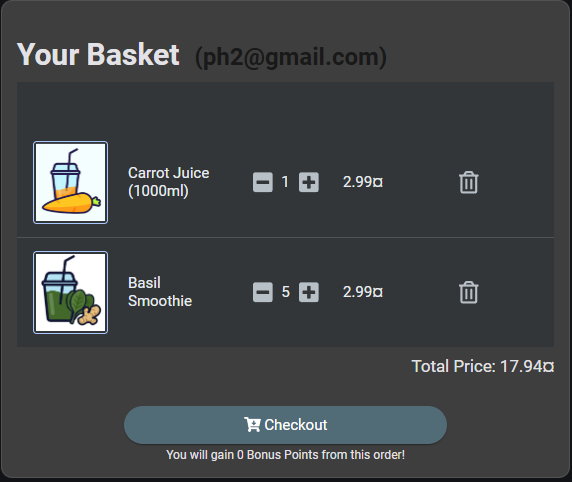
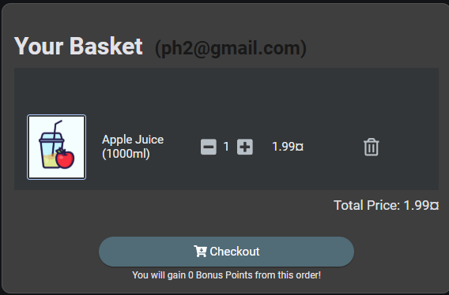
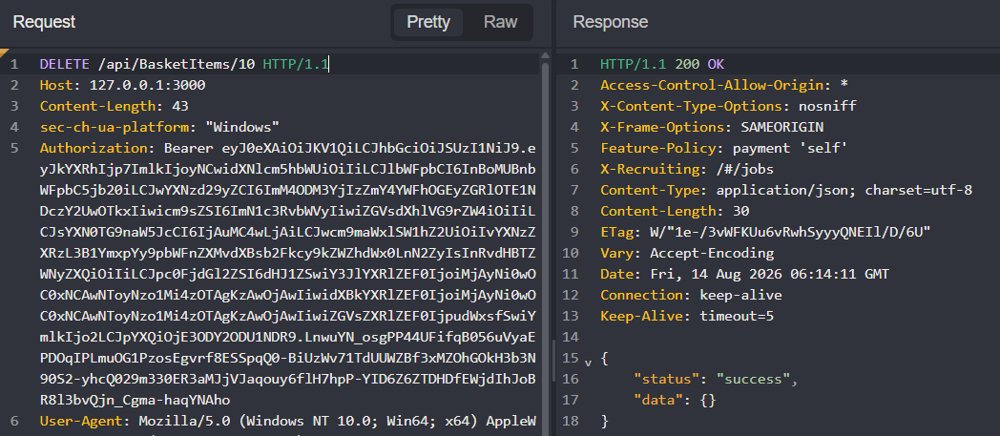
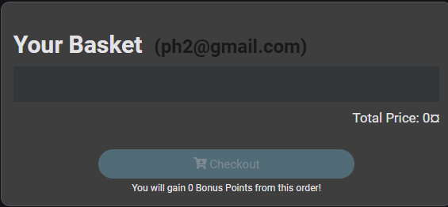

# OWASP Juice Shop — Broken Object Level Authorization in Basket Items

## Summary

OWASP Juice Shop does not consistently enforce object-level authorization on basket items. An authenticated user can reference a `BasketItem` owned by another user and modify or delete it through:

```http
PUT /api/BasketItems/{id}
DELETE /api/BasketItems/{id}
```

The backend locates the object by its identifier but does not verify that it belongs to the authenticated user's basket. This is a **Broken Object Level Authorization (BOLA)** vulnerability, also commonly described as IDOR in this context.

## Test Setup

Two controlled test accounts were used, each with a separate basket:

| Account | Basket ID |
| --- | ---: |
| `ph1` | `6` |
| `ph2` | `7` |

When a product is added, the application creates a separate basket-entry object:

```json
{
  "ProductId": 52,
  "BasketId": "7",
  "quantity": 1
}
```

The identifiers represent different resources:

- `ProductId`: the catalog product;
- `BasketId`: the user's basket;
- `BasketItem.id`: the specific product entry inside that basket.

For the modification test, the target was `BasketItem 14`, associated with `BasketId 7` and controlled by `ph2`.

## Authorization Inconsistency

While authenticated as `ph1`, attempting to create an item directly in `ph2`'s basket was rejected:

```http
POST /api/BasketItems/
Content-Type: application/json

{
  "ProductId": 50,
  "BasketId": "7",
  "quantity": 1
}
```

```http
HTTP/1.1 401 Unauthorized

{'error' : 'Invalid BasketId'}
```

This shows that the application validates `BasketId` during object creation. The same ownership check is missing when an existing `BasketItem` is addressed directly.

## Unauthorized Modification

Before the test, `ph2`'s Basil Smoothie entry had a quantity of `1`.



Using `ph1`'s authenticated session, I sent:

```http
PUT /api/BasketItems/14
Content-Type: application/json

{
  "quantity": 5
}
```

The server returned `200 OK`. Its response identifies the modified object as `BasketItem 14` in `BasketId 7` and shows the new quantity:



Returning to `ph2`'s basket confirmed that the quantity had changed from `1` to `5`.



## Unauthorized Deletion

The same issue affected deletion. Before the request, `ph2`'s basket contained an Apple Juice entry associated with `BasketItem 10`.



Using `ph1`'s authenticated session, I sent:

```http
DELETE /api/BasketItems/10
```

The request succeeded with `200 OK`:



The Apple Juice entry was removed from `ph2`'s basket.



## Root Cause

The backend appears to authorize direct operations using only the supplied `BasketItem` ID. Conceptually, the vulnerable queries behave like:

```sql
UPDATE BasketItem
SET quantity = ?
WHERE id = ?;

DELETE FROM BasketItem
WHERE id = ?;
```

No ownership condition links the target object to the authenticated user:

```text
authenticated user -> user's basket -> target BasketItem
```

## Impact

An authenticated attacker who obtains or predicts another user's `BasketItem` ID can:

- change the quantity of an item in that user's basket;
- delete an item from that user's basket.

In this lab, the direct impact is limited to shopping-cart integrity. The authorization pattern would have greater impact if repeated on sensitive objects such as orders, addresses, invoices, payment-related records, API keys, or private documents.

## Remediation

Every operation on a `BasketItem` must enforce ownership server-side. Before modifying or deleting an item, the backend should verify that:

1. the requested `BasketItem` exists;
2. it belongs to a basket associated with the authenticated user;
3. the user is authorized to perform the requested action.

The lookup should be scoped through the authenticated user's basket rather than trusting a client-supplied object ID alone. Unauthorized access should return `403 Forbidden` or a non-enumerating `404 Not Found`.

## Classification

- **Vulnerability:** Broken Object Level Authorization (BOLA)
- **Related terminology:** Insecure Direct Object Reference (IDOR)
- **Authorization boundary:** Horizontal
- **Affected operations:** Modification and deletion
- **OWASP API Security Top 10:** API1:2023 — Broken Object Level Authorization
- **CWE:** CWE-639 — Authorization Bypass Through User-Controlled Key
